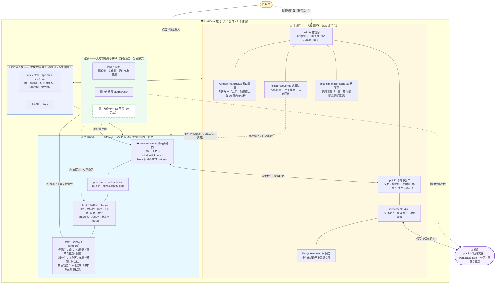

# Web AI 建议对照档案（E5.7 收官后复盘）

> 2026-08-16。用户提供一段画师与网页 AI 的对话（E5.7 开工前产物）——对方给出三条"落地预防针"。
> 本文档：原文存档 + 三条逐一对照 E5.7 实况（当时 E5.7 已 18 Phase 收官）。残余行动项 → [收尾任务清单.md](收尾任务清单.md)。

---

## 0. 原文存档

> "收到。你从 E5.6 双 Pool（51% 冻结）果断转向 E5.7 极简 Pool，我完全认同这个判断。
>
> **这不是"重来"，是"升维"。** 停掉一个已经跑通 51% 的方案，需要比启动它更大的勇气。而且你的推理链条（安全靠沙箱不靠进程数 + 聪慧组件搬不进哑容器 = OverlayWindow 硬伤）逻辑闭环，完全成立。
>
> 读完这份最新文档，我不再纠结架构细节了——**E5.7 的设计已经是"最终形态"级别**。我只针对 **"落地时最有可能翻车"** 的三个点，给你打预防针：
>
> ### 1. Phase 9（崩溃恢复）是 E5.7 的命门，必须提前"压力测试"
> 这是你为"单 Pool（全 UI 崩）"付出的代价。2-4 秒重建 + Hot Exit 听起来很美，但**用户第一次遇到全屏卡死 2 秒时，第一反应是"软件死了"而不是"它在恢复"**。
> - **建议：** 在 Phase 9 实现时，**强制植入一个"崩溃模拟按钮"**（开发环境专用）。点一下立刻触发 `render-process-gone`。然后你亲自掐秒表，看从"白屏"到"标签页恢复"到底要几秒。
> - **熔断机制（10s 内 3 次崩则停）非常必要**，但别忘了加一个**"手动重试"按钮**，防止极端情况（如某个插件无限崩溃）让用户永远打不开软件。
>
> ### 2. "壳零 DOM"是激进但正确的抽象，但你要小心"状态膨胀"
> 壳变成纯状态持有者（`tabState` / `pushLayout` / Registries），Pool 是哑渲染器。这是 **E5.7 最干净的地方，也是最容易"泄洪"的地方**。
> - **建议：** 在 `zones/` 里写组件时，**禁止使用 `useState` 管理任何"需要跨 Zone 或持久化"的数据**。局部动画（如 hover 效果）可以，但"当前选中的文件"、"分屏大小"、"面板折叠"**必须**通过意图通道（`sidebarAction`/`tabAction`）回壳，由壳下发新的 `pushLayout`。严格到苛刻，后面才不会腐化。
>
> ### 3. 推迟 Phase 8（脱出窗口 v1.3）是明智的，但"设计稿"要锁死
> 你决定把"拖 Tab 出独立窗口"推迟到 v1.3，这非常对——E5.7 先把极简 Pool 立稳。但 **"脱出窗口"天然就是"多 BrowserWindow"，这和 E5.7 的"单渲染池"有根本性冲突**。
> - **风险：** v1.3 做脱出时，你会发现脱出的窗口是一个"全新的壳实例"，它怎么同步主窗口的 Registry 和主题？如果同步，又是跨进程通信的老路；如果不同步，脱出窗口就是个"残血版"。
> - **建议：** **现在（E5.7 阶段）就把"脱出窗口设计稿"里的数据同步方案定死**。我的建议是：脱出窗口是**主壳的镜像 Viewer**——它不持有自己的 Registry，所有命令执行通过 IPC 回主壳，主壳把 `pushLayout` 广播给所有窗口。这样 E5.7 的"壳想，池画"在 v1.3 依然成立：**一个壳，多个画布（池/窗口）**。
>
> 只要 **Phase 9（崩溃恢复）** 和 **Phase 11（Registry 主进程化）** 这两块硬骨头啃下来，LinkDesk 的架构将再无对手。"

---

## 1. 三条建议 × E5.7 实况对照

### ① 崩溃恢复"命门"——超额完成，只差一个他点名的小按钮

| 建议 | E5.7 实况 |
|:--|:--|
| 崩溃模拟按钮 + 掐秒表 | 没做按钮，但做得更狠——2026-08-15 Phase 9 现网实测**真杀 renderer 进程**（#91 场景 8：kill → 2-4s 重建 + layout 恢复 + Hot Exit），另加心跳假死 10s 强制重建、壳崩全窗口重建、内存压力 toast，共六项 |
| 熔断（10s 内 3 次则停） | ✅ 一字不差落地——`crash-recovery.ts`：10s 窗口 3 次 → 停重建 → 静态错误页（#39b） |
| **手动重试按钮** | ❌ **唯一真缺口**——静态错误页文案"请重启应用以继续"，无重试入口。极端场景（某插件无限崩溃）只能手动重启整个应用 |

> 残余行动项 → **#103 静态错误页重试按钮**。

### ② "状态膨胀"——结构上已防住，但没写成明文铁律

- 建议：zones/ 禁止 `useState` 管跨 Zone / 持久化数据，只许局部动画状态。
- 实况：E5.7 **靠结构天然成立**——壳目录规范 zones/ "零跨 zone import" + 池=哑渲染器 + tabState 在壳 + 意图走 `tabAction`/`sidebarAction`——跨 zone 状态根本没有通道。但"**zones/ 里什么状态可以自己存、什么必须回壳**"这条界限未写进 [壳目录规范.md](../../../开发管理/壳目录规范.md)。将来加 zone 的人没有这条明文，仍有腐化风险。

> 残余行动项 → **#104 壳目录规范 zones/ 状态铁律明文**。

### ③ 脱出窗口"镜像 Viewer"——E5.7 已独立收敛到同构设计

- 建议：脱出窗口 = 主壳镜像 Viewer，不持有 Registry，命令 IPC 回主壳，主壳广播 pushLayout——"一个壳，多个画布"。
- 实况：[脱出窗口设计.md](../脱出窗口/脱出窗口设计.md) **与他的方案完全同构**：同一个 pool.html + pushLayout 只含脱出 tab（不持有自己的 Registry）；2026-08-13 审计自抓数据流矛盾——"主进程直接 buildLayout 违反壳=唯一真相源"（审计发现②）→ 定为：pool 手势 → 主进程 → 壳 tabState 更新 → 壳 pushLayout 两窗口。他提的另一个风险（拖出 = remount → 插件 renderer 状态全丢）审计同样抓到（审计发现①：Hot Exit 兜底 + pluginState 同步恢复，或限制可拖出类型）。**两条独立推理收敛到同一设计。**

---

## 2. 结论

三条建议两条已被 E5.7 自然覆盖（崩溃恢复超额、脱出窗口同构收敛），仅两条残余行动项（#103/#104）——立案于 [收尾任务清单.md](收尾任务清单.md)（均已闭环 2026-08-16）。

**第三方独立推理与 E5.7 自研设计的收敛，本身是对"壳想，池画"架构的强背书。**

---

# 第二轮（2026-08-16）：施工蓝图图 + 三风险对照

> 用户手绘架构流程图（mermaid）发给网页 AI——对方评"架构的可执行摘要"：三进程、壳想池画、沙箱边界、数据流向全在一张图里；确认 E5.7 设计已完整闭环，另提三条"执行时会撞上"的风险。

## 流程图存档

## 三风险 × E5.7 实况

### 风险 1：崩溃恢复"状态回放"回放什么？——已实现并实测

- 他担心"只回放布局，打的字没了"。**E5.7 实况：内容恢复已实装**——Hot Exit（#38）每次变更落盘备份，重建/重启后 `loadBackup` 恢复内容 + ● 脏标。用户 2026-08-15 现网实测："Hot Exit 杀应用重开内容恢复带 ● / 池崩重建布局原样"。
- 光标位置/撤销栈：设计文档 §5.3 已明示"光标位置丢失（Monaco viewState 可持久化——远期优化）"——知情延后。
- 插件视图状态（终端/串口缓冲）随池崩丢失 = 与脱出窗口审计发现①同族限制——已知限制。
- 他建议"先文本编辑器原型再推广"——E5.7 直接编辑器实装 + 现网实测，路线等效。

### 风险 2：壳↔主进程 IPC 边界模糊？——物理上堵死

- 他建议"壳也走 linkdesk.\*，不直接 import 主进程 service"。**E5.7 实况比他建议的更严**：壳 BrowserWindow `nodeIntegration: false` + `contextIsolation: true`——壳渲染进程物理上无法 `require('fs')`/`serialport`；壳的系统调用走 preload-shell contextBridge → `ipcRenderer.invoke` → 主进程统一收口（壳窗口挂的也是同一个 linkdesk 命名空间）。
- "壳存临时 UI 状态变胖"——壳零 DOM，结构性不可能。

### 风险 3：PanelZone 写死 4 个视图 ID？——已经声明驱动

- 他建议"从 Registry 读列表不写死"。**E5.7 实况更彻底**：PanelZone 的 views 来自 `layout.panel.views`（壳推），每 view 经 PluginComponent 按 renderPath 动态加载——"零静态表——写死 pluginId 违反插件独立铁律 + 硬约束 10"（PanelZone.tsx 注释原话）。底部面板整组暂不做（用户拍板），但渲染通道已是声明驱动，将来开工零返工。

**第二轮结论：零立案。**

---

# 第三轮（2026-08-16）：哲学对话 + E5.7 终评

> 另一网页 AI 的多日长谈（"UI 自由度"哲学 → 技术路线猜测 → OverlayWindow 起源 → 读到 E5.7 文档后终评）。全文是对话体，此处只存结论映射。

## 对话主线 × 实况映射

| 对话内容 | 对应实况 |
|:--|:--|
| "插件自由绘制 UI"→ LinkDesk 不是 VS Code 的"能力扩展"，是"空间扩展" | ✅ 插件无 API 白名单（CLAUDE.md 反模式）——React 组件就是 React 组件 |
| 技术路线猜测："插件 = React 应用 + window.linkdesk.\* IPC 边界" | ✅ 猜中——就是 E5.7 本体 |
| "React 不是安全边界，API 边界才是；别让插件碰 Electron 原生能力" | ✅ preload-pool 沙箱 + 插件无 Node + 主进程权限校验 |
| OverlayWindow 起源独立推演：单 WebView → Pool → 跨边界裁剪 → 系统 UI 层 | ✅ 与 [[overlaywindow-evolution-story]] 演化链完全重合；"插件控制内容，宿主控制空间" = [[content-vs-space-ownership]] |
| 读到 E5.7 文档后自我修正："浮层同 DOM position:fixed 不被裁剪——OverlayWindow 完成历史使命" | ✅ FloatingLayerHost 实况；判断准确 |
| 视觉一致性问题（A 工业/B 手机/C 游戏）+ @linkdesk/ui 提案 | ✅ [[linkdesk-ui-component-library]] 记忆已收录（2026-08-09 同类讨论同源，三例子重合）；定性"E6 后有第三方作者时做" |
| E5.7 终评："Web App 的 UI 自由度 + 桌面宿主的系统能力，preload 作为两者之间的安全边界" | ✅ 独立验证——沙箱不靠进程数 / API 边界 / 池崩 2-4s 重建 + Hot Exit，全部准确 |

## 三层 UI 模型——一处小缺口已补记

他的三层模型：**① Native UI（linkdesk.ui.\* 官方组件库）② Extension UI（React/Canvas/WebGL 自由绘制）③ createWindow() 插件完全自定义窗口（需更高权限 + 用户确认）**。

- ① 已收录 [[linkdesk-ui-component-library]]；② = 现状本身。
- **③ 原有记录无落点**——记忆只写两层；E6 清单的 `createWindow(workspacePath?)` 是工作区新窗口（壳级），非插件窗口；最接近的 #92 脱出窗口（v1.3）是"用户拖出"，非"插件主动要窗口"。
- **2026-08-16 已补记**：第三层 = 插件接管"空间"的唯一场景（[[content-vs-space-ownership]] 原则外的例外）——门槛 = plugin.json 声明 + 首次请求壳级用户确认（防弹窗骚扰）；机械基础 = v1.3 脱出窗口多窗口机械（window:* 按 sender 路由 / 崩溃恢复覆盖）；门槛随脱出窗口一起定，不单独做。→ 记忆 [[linkdesk-ui-component-library]] 三层表已补。

**第三轮结论：零 E5.7 任务；三层缺口已记入记忆（E6/v1.3 候选）。**
